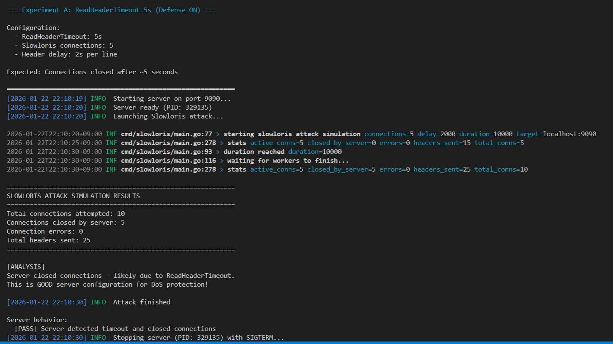
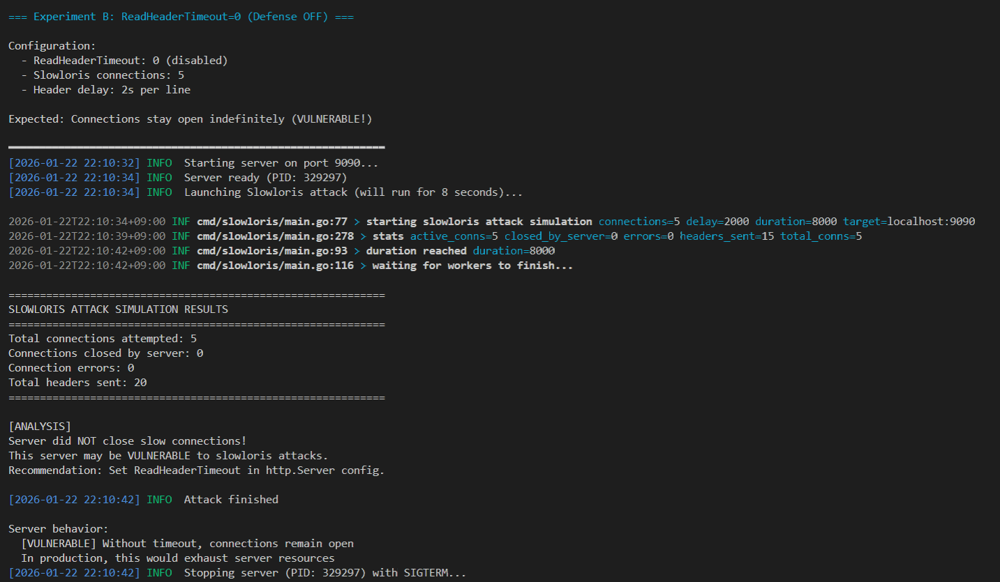
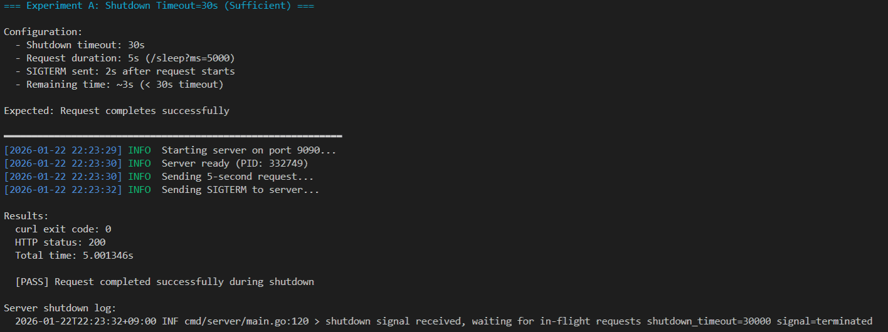
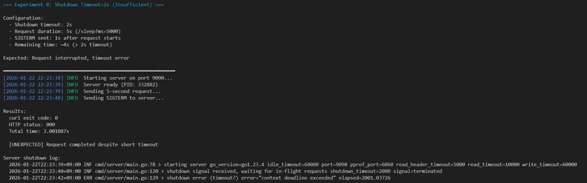
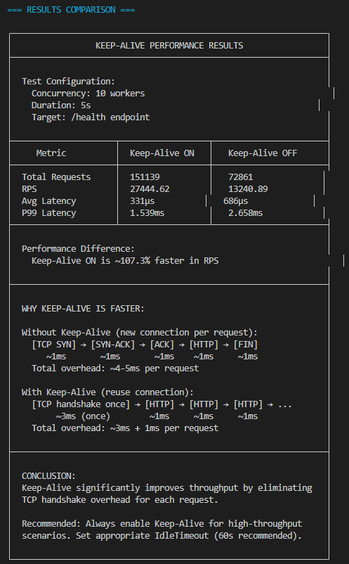

# Go HTTP 서버 패키지 테스트 해보는 프로젝트

> `net/http.Server`가 실제로 어떻게 동작하는지 소스 코드 분석하고 실험으로 검증을 하였습니다.

## 테스트 이유

개념적 학습을 위해서 
- 타임 아웃 설정을 왜 해야하는지, 
- Graceful Shutdown도 왜 필요한지 어떻게 동작하는지를 학습하기 위해 기획하게 되었습니다. 

1. Go 소스 코드 기반으로 실제 구현에서
2. 가설을 세우고
3. 테스트로 검증을 하는 플로우로 프로젝트를 기획하게 되었습니다.

---

## 실험 환경

```
Go: 1.23.4
OS: Ubuntu (WSL2)
분석 대상: $GOROOT/src/net/http/server.go
```

## 프로젝트 구조

```
go-http-lab/
├── cmd/
│   ├── server/       # 실험용 HTTP 서버
│   ├── slowloris/    # Slowloris 공격 시뮬레이터
│   └── loadgen/      # 부하 테스트 도구
├── scripts/          # 재현 가능한 실험 스크립트
├── docs/             # 소스 코드 분석 문서
└── results/          # 실험 결과
```

---

# 실험 1: Slowloris와 ReadHeaderTimeout

## 문제 상황

Slowloris 공격은 HTTP 헤더를 아주 천천히 보내서 서버 연결을 점유하는 공격입니다.

```
공격자가 하는 일:
1. TCP 연결
2. "GET / HTTP/1.1\r\n" 전송
3. 2초 대기
4. "Host: victim.com\r\n" 전송
5. 2초 대기
6. "X-a: b\r\n" 전송
7. 계속 반복... (헤더 끝을 안 보냄)

서버는 헤더가 끝나길 무한정 기다리게 되어서 → 연결이 고갈되게 됩니다.
```

## 가설

> `ReadHeaderTimeout`을 설정하면 느린 헤더 전송을 차단할 수 있을 것임.

## 테스트 A: ReadHeaderTimeout=5s (방어 ON)



**관찰:**
- 5개 연결 시도
- 서버가 5개 모두 닫음
- 약 5초 후 연결 종료

## 테스트 B: ReadHeaderTimeout=0 (방어 OFF)



**관찰:**
- 5개 연결 시도
- 서버가 0개 닫음
- 연결이 계속 유지됨

## 결론

| 설정 | 결과 |
|------|------|
| ReadHeaderTimeout=5s | 5초 후 연결 강제 종료 (방어됨) |
| ReadHeaderTimeout=0 | 연결 무한 유지 (취약함) |

**한 줄 정리:** `ReadHeaderTimeout: 5 * time.Second` 하나로 Slowloris 방어가 가능함이 테스트 되었습니다.

---

# 실험 2: Graceful Shutdown은 정말 Graceful한가

## 문제 상황

서버 재시작할 때 진행 중인 요청은 어떻게 될까? 에 대한 고민으로 제안하게 되었음.

Go 문서에는 이렇게 써있었습니다.
> "Shutdown gracefully shuts down the server without interrupting any active connections."

## 가설

> Shutdown timeout이 요청 처리 시간보다 길면 요청이 완료되고, 짧으면 중간에 끊길 것이다.

## 테스트 A: Shutdown timeout > 요청 시간

조건:
- 5초 걸리는 요청 실행
- 2초 후 SIGTERM 전송
- Shutdown timeout: 30초



**관찰:**
- curl 정상 완료 (exit 0)
- 서버 로그: "shutdown completed gracefully"
- 요청이 끝난 후 서버 종료

## 테스트 B: Shutdown timeout < 요청 시간

조건:
- 5초 걸리는 요청 실행
- 1초 후 SIGTERM 전송
- Shutdown timeout: 2초



**관찰:**
- curl 실패 (exit 52, empty reply)
- 서버 로그: "context deadline exceeded"
- 요청 중간에 연결 끊김

## 결론

```
Shutdown timeout > 남은 요청 시간 → 요청 완료 후 종료
Shutdown timeout < 남은 요청 시간 → 요청 중단
```

**한 줄 정리:** Graceful Shutdown은 마법이 아니다. timeout 설정이 핵심이다.

---

# 테스트 3: Keep-Alive 성능 차이

## 문제 상황

Keep-Alive가 좋다는 건 아는데, **얼마나** 좋은지 또 왜 좋은지 자세하게 몰라서 하게됨

## 가설

> Keep-Alive OFF면 매번 TCP 핸드셰이크가 발생해서 느려질 것이다.



## 결과

| 지표 | Keep-Alive ON | Keep-Alive OFF | 차이 |
|------|---------------|----------------|------|
| RPS | 27,444 | 13,240 | **+107%** |
| Avg Latency | 331µs | 686µs | -52% |
| P99 Latency | 1.5ms | 2.6ms | -42% |

## 왜 이런 차이가 나는가

```
Keep-Alive OFF:
[SYN]→[SYN-ACK]→[ACK]→[Request]→[Response]→[FIN]
       ~~~3ms~~~        ~~~1ms~~~
= 매 요청 ~4ms 오버헤드

Keep-Alive ON:
[SYN]→[SYN-ACK]→[ACK]→[Req1]→[Res1]→[Req2]→[Res2]→...
       ~~~3ms (1회)~~~   ~1ms    ~1ms    ~1ms
= 연결 재사용으로 오버헤드 최소화
```

**한 줄 정리:** Keep-Alive는 선택이 아니라 필수다.

---

# 학습한 것들...

### 1. Timeout = 생존 메커니즘 입니다.

```
Timeout 발동 → 하나의 요청 실패
Timeout 없음 → 서버 전체 마비 가능
```

Timeout은 "정확성"을 포기하고 "가용성"을 선택하는 것이라고 할 수 있습니다.

### 2. Graceful이라는 것은 항상 Graceful하진 않다.

`server.Shutdown(ctx)`의 ctx에 timeout이 없으면 무한 대기할 수 있다.

### 3. 추측하지 말고 측정하자

"Keep-Alive가 좋다"는 알았지만, 직접 측정하니 체감이 달랐다.

---

# 테스트 재현 방법

```bash
# 빌드
go build -o bin/server ./cmd/server
go build -o bin/slowloris ./cmd/slowloris
go build -o bin/loadgen ./cmd/loadgen

# 개별 실험
./scripts/01_slowloris.sh
./scripts/02_shutdown.sh
./scripts/03_keepalive.sh

# 전체 실험
./scripts/run_all.sh
```

---
